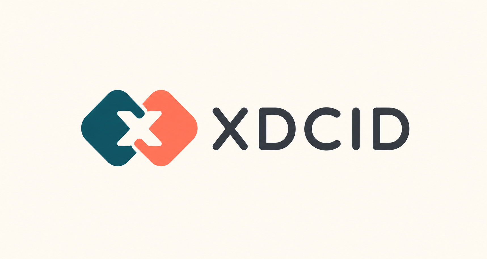

<p align="center">
  
</p>

# XDCID

Wallet-native `.xdc` identities, multichain resolution, signed registration, subdomains, and Pay Links on XDC mainnet.

## Stack

- Next.js, TypeScript, Tailwind
- Hardhat Solidity contracts
- viem/wagmi frontend
- OpenZeppelin Ownable/ReentrancyGuard

## Contracts

- `XNSRegistry`: stores owner, resolver, and expiry by `bytes32` node.
- `XNSRegistrar`: validates `.xdc`, prices by yearly label length, registers and renews names.
- `XNSResolver`: stores address and text records for `avatar`, `website`, `twitter`, `telegram`, and `bio`.
- `XNSReverseResolver`: lets users set their own primary name when they own the node.

For this MVP, `nodeFor(name)` is `keccak256(bytes(name))`. Use the helper everywhere instead of recomputing differently.

The frontend displays the suffix as `.XDC`, but canonicalizes registrations to lowercase `.xdc` before calling contracts. The registrar accepts `.xdc` case-insensitively for direct contract calls.

## XDC Mainnet Deployment

| Contract | Address |
| --- | --- |
| XNSRegistry | [`0x05fa64a05bc205DeDF47e023d2D90c2d119cd097`](https://xdcscan.com/address/0x05fa64a05bc205DeDF47e023d2D90c2d119cd097) |
| XNSRegistrar V2 (active) | [`0xdEaf1742614908a8d170f4c9520c3cd1e967ef36`](https://xdcscan.com/address/0xdEaf1742614908a8d170f4c9520c3cd1e967ef36) |
| XNSPricingPolicy V2 | [`0x8aE4b7E57b6693c70FD40F5De17974CA5AB6DB94`](https://xdcscan.com/address/0x8aE4b7E57b6693c70FD40F5De17974CA5AB6DB94) |
| XNSDiscountAuthorization | [`0x9EE907230d351264403555fA6967EA44Ba31A5d1`](https://xdcscan.com/address/0x9EE907230d351264403555fA6967EA44Ba31A5d1) |
| XNSSubdomainRegistrar | [`0x27b6Ef20912B50F7b86f6C0Aed75d0ddFD7DA1C7`](https://xdcscan.com/address/0x27b6Ef20912B50F7b86f6C0Aed75d0ddFD7DA1C7) |
| XNSResolver | [`0x52bfa70B30190050F77033Fe427De8B3d4A8F453`](https://xdcscan.com/address/0x52bfa70B30190050F77033Fe427De8B3d4A8F453) |
| XNSReverseResolver | [`0x8b1a236845b0CC84094578cEd97844b8dC5f139f`](https://xdcscan.com/address/0x8b1a236845b0CC84094578cEd97844b8dC5f139f) |
| XNSMultichainResolver | [`0x978d46Ba080Ae71b5cB39691106A1cCf6C6c7240`](https://xdcscan.com/address/0x978d46Ba080Ae71b5cB39691106A1cCf6C6c7240) |

The Registry and active Registrar protocol owner is `0xe82a4267CC310FC6Db334601671A043DFc8Ce06A`.

- The [Registry ownership transfer](https://xdcscan.com/tx/0x90049270910803f91186caf7ea04d6e7b261f92a1aaa56f37329c73de2657ef1) moved Registry control to this owner.
- The active Registrar v2 was deployed with this address as its initial owner, so it did not require a separate ownership-transfer transaction.

Only the Registry and Registrar implement OpenZeppelin `Ownable`. The Resolver contracts authorize individual name owners through the Registry and do not have protocol ownership to transfer.

## Setup

```bash
pnpm install
cp .env.example .env
```

This repo pins pnpm settings in `.npmrc` to use `https://registry.npmjs.org/`, `strict-ssl=true`, exact package saves, and store integrity checks. Do not install with `--config.strict-ssl=false`.

If pnpm fails with `UNABLE_TO_VERIFY_LEAF_SIGNATURE`, fix the local certificate trust chain or configure a trusted CA with `NODE_EXTRA_CA_CERTS`. Keep `strict-ssl=true`.

On Windows with Node 24+, you can also keep TLS verification enabled while using the Windows certificate store:

```cmd
set NODE_OPTIONS=--use-system-ca
pnpm install
```

Fill `PRIVATE_KEY` only in a local or protected deployment environment for deploys and owner-only maintenance scripts. Never commit a production key. The default XDC mainnet RPC is `https://earpc.xinfin.network`.

## Test

```bash
pnpm test
```

Tests cover register, duplicate fail, expired availability, pricing, resolver owner-only, reverse owner-only, and renew.

## Deploy To XDC Mainnet

```bash
pnpm deploy:xdc
```

The deploy script writes contract addresses to `frontend/config/addresses.ts`. You can also set:

```bash
NEXT_PUBLIC_XNS_REGISTRY=
NEXT_PUBLIC_XNS_REGISTRAR=
NEXT_PUBLIC_XNS_SUBDOMAIN_REGISTRAR=
NEXT_PUBLIC_XNS_RESOLVER=
NEXT_PUBLIC_XNS_REVERSE_RESOLVER=
```

## Transfer Ownership

The Registry and Registrar use OpenZeppelin `Ownable`. Run the transfer script with the current owner's key supplied securely through `PRIVATE_KEY` and the intended wallet or multisig in `NEW_OWNER`:

```bash
NEW_OWNER=0x... pnpm transfer-ownership:xdc
```

The script uses XDC-compatible legacy transactions, verifies the connected signer is the current owner, skips contracts already owned by the target, and confirms the resulting owner after each transaction.

## Run Frontend

```bash
pnpm dev
```

Open the Next.js URL and connect a wallet on XDC mainnet, chain ID `50`.

## Read-only API

The complete OpenAPI 3.1 contract is published at [`/openapi.yaml`](frontend/public/openapi.yaml) and is served by the deployed frontend at `/openapi.yaml`.

The first API version exposes public XDC mainnet reads and short-lived payment authorization:

- `GET /api/v1/names/{name}?years=1` returns canonical name data, forward resolution, availability, pricing, expiry, and profile records.
- `GET /api/v1/reverse/{address}` returns the wallet's verified primary name, or `null` when the stored reverse record is stale or missing.
- `GET /api/v1/addresses/{address}/names` returns the verified primary ID and active owned-name inventory.
- `GET /api/v1/pricing/quote` returns informational USD policy pricing and a buffered XDC estimate.
- `POST /api/v1/registrar/quote` returns a signed registration or renewal quote.
- `POST /api/v1/subdomain/quote` returns a signed subdomain registration or renewal quote.
- `POST /api/pay-links` stores an already signed payment request and returns a short path plus private revocation token.
- `GET /api/pay-links/cancellations/{requestId}` reports whether a payment request is active, cancelled, or paid.

The repository SDK supports both direct on-chain reads/write preparation and typed HTTP integration for browser, Node.js, and Web2 services. See [`sdk/README.md`](sdk/README.md) and the deployed [`/docs`](https://xdcid.xyz/docs) page.

New top-level registrations use the server-enforced `registration-rollout`
mode (`closed`, `beta`, or `public`). In beta mode, only a pre-approved wallet
and its exact five-letter name can receive a one-year, single-use 100% discount
quote. Renewals remain available. See [`docs/feature-flags.md`](docs/feature-flags.md)
for the rollout and operator procedure.

The name endpoint accepts either a bare label or a `.xdc` name. The optional `years` parameter must be an integer from 1 through 100 and controls the total registration-price quote.

### XDC AI gateway upstream

Five focused upstream routes are available for the XDC AI Gateway:

- `GET /api/xdcai/v1/resolve/{name}` returns ownership, forward resolution, and expiry.
- `GET /api/xdcai/v1/reverse/{address}` returns the verified primary name.
- `GET /api/xdcai/v1/availability/{name}?years=1` returns availability, expiry, and pricing.
- `GET /api/xdcai/v1/profile/{name}` returns the profile records.
- `GET /api/xdcai/v1/owned-names/{address}` returns the verified primary ID and active owned names.

These routes require the `X-XDCID-Gateway-Key` request header to match the server-only `XDCID_GATEWAY_API_KEY` environment variable. If the variable is missing, the routes fail closed with HTTP 503; invalid credentials return HTTP 401. Never commit the key or expose it through a `NEXT_PUBLIC_*` variable. Agents call the paid `api.xdcai.tech` service URL rather than these protected upstream URLs directly.

Set `XDC_RPC_URLS` to a comma-separated, ordered list of server-side RPC endpoints. `XDC_RPC_URL` and `XDC_MAINNET_RPC_URL` remain supported as single-endpoint compatibility settings, and public XDC endpoints are appended as fallbacks. Keep authenticated provider URLs in server-only variables; never put a secret provider URL in a `NEXT_PUBLIC_*` variable.

Each endpoint has a 3.5-second timeout by default (`XDC_RPC_TIMEOUT_MS`, bounded from 1 to 10 seconds). Successful name and reverse lookups are cached in memory for 15 seconds by default (`XDC_API_CACHE_TTL_MS`, bounded from 1 to 60 seconds). The cache is limited to 500 entries per warm server instance, coalesces concurrent identical reads, and never retains failed RPC requests.

### Versioning and compatibility

The URL and every application JSON response identify version `v1`. New optional response fields may be added without changing the version; removing or renaming fields, changing their types, or changing documented semantics requires a new `/api/v2` path. Clients should ignore unknown response fields.

The Vercel edge may return HTTP 429 before the application route runs. That platform-managed response is documented in the OpenAPI contract but does not use the application JSON envelope.

### Error responses

Every API error uses the same versioned envelope:

```json
{
  "version": "v1",
  "error": {
    "code": "INVALID_ADDRESS",
    "message": "address must be a valid EVM address"
  }
}
```

Validation errors return HTTP 400 with one of `INVALID_NAME`, `INVALID_ADDRESS`, or `INVALID_YEARS`. XDC RPC failures return HTTP 503 with `XDC_RPC_UNAVAILABLE`. Internal error details are logged server-side and are never included in API responses.
